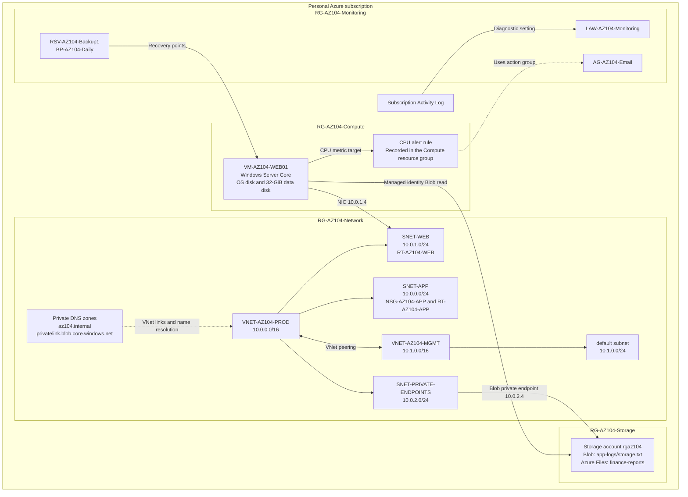

# Lab architecture and stages

[Project overview](../README.md)

This layout records the main exercise stages. It is not a claim that every resource remains deployed or that all stages existed at the same time. I have retained private lab address ranges because they explain the tests; public addresses and account identifiers are excluded.



The arrows combine relationships and tests recorded at different stages. In particular, the managed-identity Blob read and the later private-endpoint DNS result are separate evidence items; the diagram does not claim that the Blob transfer used Private Link.

<details>
<summary>Text version of the topology</summary>

```text
Personal Azure subscription
|
+-- RG-AZ104-Network
|   +-- VNET-AZ104-PROD: 10.0.0.0/16
|   |   +-- SNET-APP: 10.0.0.0/24
|   |   |   +-- NSG-AZ104-APP / RT-AZ104-APP
|   |   |   +-- No application VM for the routing test
|   |   +-- SNET-WEB: 10.0.1.0/24
|   |   |   +-- WEB01 NIC: 10.0.1.4
|   |   |   +-- RT-AZ104-WEB
|   |   +-- SNET-PRIVATE-ENDPOINTS: 10.0.2.0/24
|   |       +-- Blob private endpoint NIC: 10.0.2.4
|   +-- VNET-AZ104-MGMT: 10.1.0.0/16
|   |   +-- default subnet: 10.1.0.0/24
|   +-- PROD <--> MGMT peering
|   +-- Private DNS: az104.internal
|   +-- Private DNS: privatelink.blob.core.windows.net
|
+-- RG-AZ104-Compute
|   +-- VM-AZ104-WEB01 (Windows Server Core)
|   +-- OS disk + 32-GiB data disk
|   +-- VM NIC, RDP NSG and public-IP resource (address withheld)
|
+-- RG-AZ104-Storage
|   +-- rgaz104
|       +-- Blob: app-logs/storage.txt
|       +-- Azure Files: finance-reports
|
+-- RG-AZ104-Monitoring
    +-- LAW-AZ104-Monitoring
    +-- AG-AZ104-Email
    +-- RSV-AZ104-Backup1 / BP-AZ104-Daily
```

</details>

The CPU alert review placed the alert resource in the Compute resource group while monitoring WEB01. Moving it to Monitoring was discussed, but a completed move is not evidenced. Although `SNET-MGMT` was requested earlier in the exercise, evidence 45 records the management subnet that actually appeared later as `default`; the layout uses that observed name.

## Separate temporary Bicep deployment

I also used a separate, temporary network deployment for the Infrastructure as Code exercise:

```text
RG-AZ104-Network
+-- NSG-AZ104-BICEP-TEST: initial 443 rule, later changed to 8443
+-- NSG-AZ104-BICEP-PARAM: parameter-file deployment using port 443
+-- VNET-AZ104-BICEP-LAB: 10.2.0.0/16
    +-- SNET-WEB: 10.2.1.0/24
        +-- NSG-AZ104-BICEP-WEB association
```

This second `SNET-WEB` belongs to the temporary Bicep VNet, not to `VNET-AZ104-PROD`. The templates were small learning examples rather than a full conversion of the original lab to Infrastructure as Code.

## Traffic tests recorded

- I retrieved `app-logs/storage.txt` from WEB01 with its managed identity and received `test1`.
- I resolved the `web01` A record and `portal` CNAME to `10.0.1.4`.
- I resolved the normal Blob Storage hostname to the private endpoint address `10.0.2.4`.
- I inspected the route selected from WEB01 to `10.0.0.4` before and after removing a deliberately bad UDR.

The peering state was connected, but I did not capture a workload-to-workload test between PROD and a running management VM. The route rollback restored Azure's system routing decision; it did not prove that an application was reachable because no destination workload existed.
