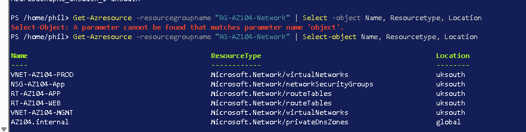
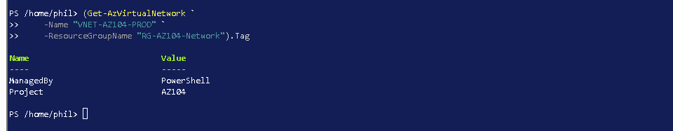
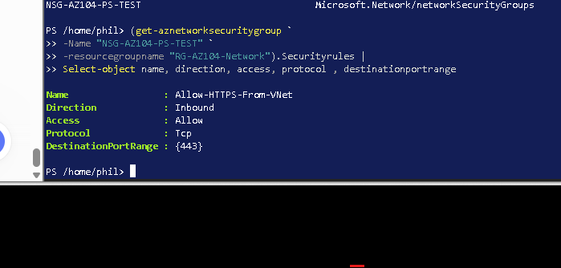
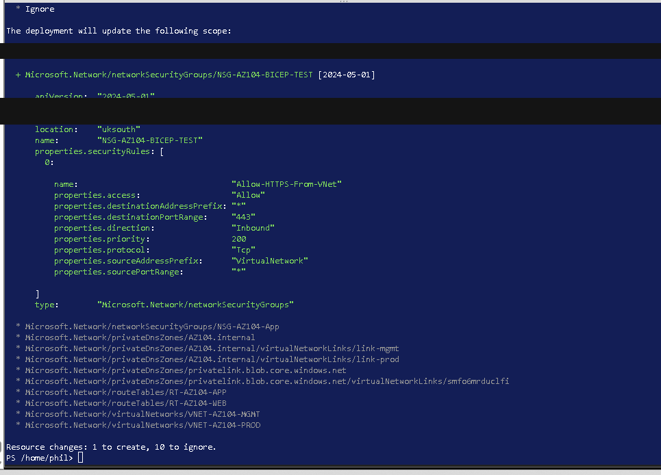
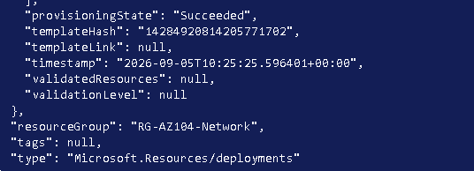
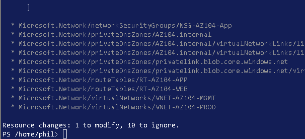
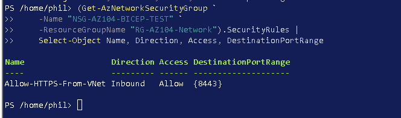
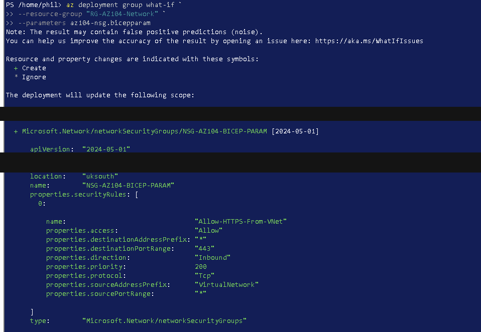
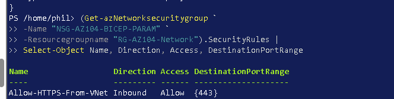
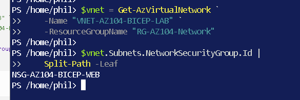

# PowerShell and Bicep

[Project overview](../README.md) · [Bicep source provenance](Bicep/README.md)

## PowerShell work

I used Azure PowerShell to list resources, retrieve VNet properties, merge a tag without replacing existing tags, create and inspect a temporary NSG, and remove that temporary test NSG.

My first resource-inventory pipeline used an incorrect `Select` parameter form, which PowerShell rejected. I corrected it to `Select-Object` and returned the Network resource group's resource names, types and locations.

*Evidence 59: the captured sequence retains the command error and the successful resource inventory rather than showing only the final output.*

For the tag exercise, I used a merge operation so that `ManagedBy = PowerShell` was added without removing `Project = AZ104`.

~~~powershell
$vnet = Get-AzVirtualNetwork `
    -Name "VNET-AZ104-PROD" `
    -ResourceGroupName "RG-AZ104-Network"

Update-AzTag `
    -ResourceId $vnet.Id `
    -Tag @{ManagedBy="PowerShell"} `
    -Operation Merge
~~~

*Evidence 60: the query output shows both tag values after the merge.*

For the temporary NSG exercise, I queried the resulting security rule and checked its direction, action, protocol and destination port.

*Evidence 61: `Allow-HTTPS-From-VNet` is shown as an inbound TCP allow rule for port 443.*

The [PowerShell command notes](Powershell/README.md) separate read and verification commands from the Azure write operations used during the lab. They are documentation, not instructions to rerun the exercises.

## Bicep workflow

I practised a reviewable sequence: define the desired state, build or preview it, deploy it and query the resulting resource.

### Initial NSG preview and deployment

The first NSG template defined an inbound HTTPS rule. I ran what-if before deployment.

*Evidence 62: one NSG creation was predicted while the listed existing resources were ignored.*

A what-if result is a prediction rather than deployment proof. I then ran the recorded deployment and captured a succeeded provisioning state.

*Evidence 63: the deployment resource reports `provisioningState: Succeeded`.*

### Port update

I changed the rule's destination port from 443 to 8443 and previewed the update.

*Evidence 64: the summary reports one modification, but the property-level port difference is outside the captured crop.*

After deployment, I queried the rule and confirmed the changed destination port.

*Evidence 65: the deployed `Allow-HTTPS-From-VNet` rule reports destination port 8443.*

### Parameterised NSG

The later template accepts the resource name, location and destination port as parameters:

~~~bicep
param location string = 'uksouth'
param nsgName string
param destinationPort string = '443'
~~~

The paired parameter file uses a relative `using` reference:

~~~bicep
using './az104-nsg.bicep'

param nsgName = 'NSG-AZ104-BICEP-PARAM'
param location = 'uksouth'
param destinationPort = '443'
~~~

I previewed the parameter-file deployment:

*Evidence 66: the preview resolves the supplied name, UK South location and TCP 443 rule.*

After deployment, I queried the NSG rule:

*Evidence 67: the deployed rule is visible with direction, action and destination port.*

### Multi-resource network template

A separate template declared an NSG, VNet and inline subnet. The subnet association used the Bicep symbolic resource reference:

~~~bicep
networkSecurityGroup: {
  id: nsg.id
}
~~~

The deployment was reported as successful. I then queried the deployed VNet and selected the subnet's network-security-group resource name.

*Evidence 68: the subnet association resolves to `NSG-AZ104-BICEP-WEB`; this verifies the relationship but is not a separate deployment-status capture.*

## Source files used

| File | Purpose and recorded version |
|---|---|
| [az104-nsg.bicep](Bicep/az104-nsg.bicep) | Owner-supplied original of the later parameterised NSG and inbound rule definition |
| [az104-nsg.bicepparam](Bicep/az104-nsg.bicepparam) | Owner-supplied original containing `NSG-AZ104-BICEP-PARAM`, UK South and port 443 values |
| [az104-network-stack.bicep](Bicep/az104-network-stack.bicep) | Recovered temporary VNet, inline subnet and referenced NSG template; original not supplied |
| [az104-network-stack.bicepparam](Bicep/az104-network-stack.bicepparam) | Owner-supplied original values for the temporary network deployment |
| [extension-test.ps1](Powershell/extension-test.ps1) | Two-line local file-creation script transcribed from evidence 31 |

I compared the owner-supplied `az104-nsg.bicep`, `az104-nsg.bicepparam` and `az104-network-stack.bicepparam` files with the recovered copies. Their executable content and parameter values matched; the recovered copies differed only by provenance comments and terminal-newline normalisation. The repository now uses the supplied source content for those three files. `az104-network-stack.bicep` remains recovered from the recorded lab code, and `extension-test.ps1` remains transcribed from evidence 31.

## What I learned and limitations

I learned how parameter files separate environment values from resource structure and how symbolic references express resource relationships. I also learned that Cloud Shell is not a durable source-code repository: a working file disappeared between sessions and was recreated from the recorded exercise.

The templates are small learning examples, not production security baselines. They retain Azure's default NSG rules and do not convert the whole historical lab to Infrastructure as Code. Microsoft also describes [Bicep what-if](https://learn.microsoft.com/en-us/azure/azure-resource-manager/bicep/deploy-what-if) as a preview of changes; I keep deployment and verification evidence separate from that preview.

No deployment or deletion command was run for this documentation update.
