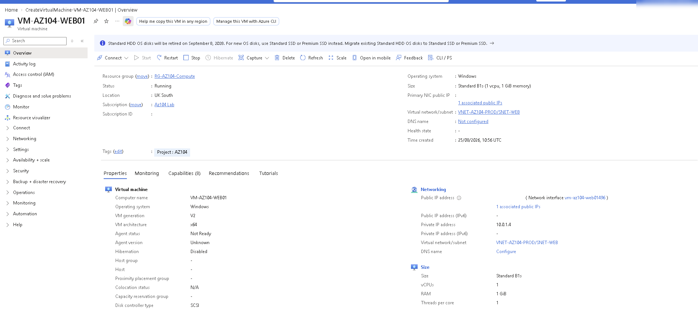
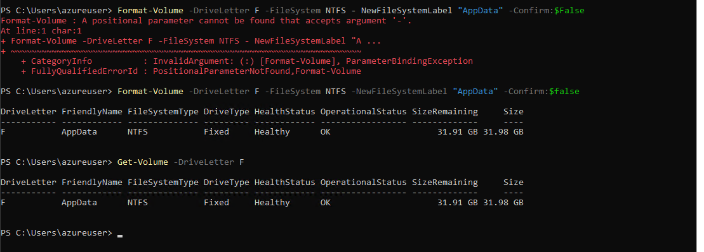
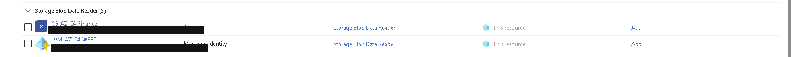
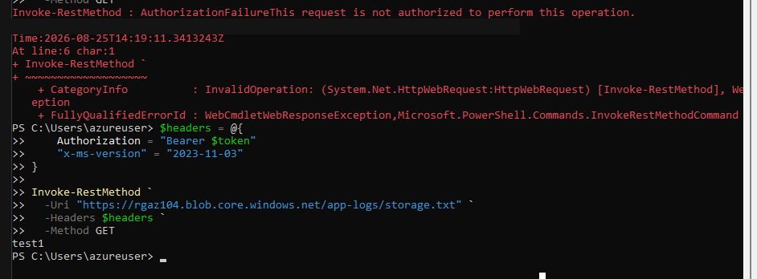
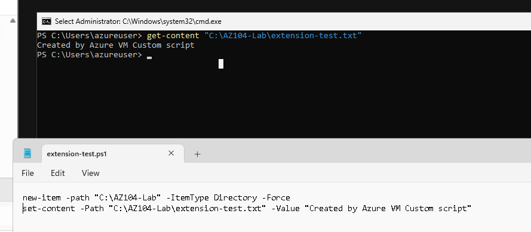

# Compute and workload identity

[Project overview](../README.md)

## Purpose and VM context

I deployed `VM-AZ104-WEB01`, a small Windows Server VM in UK South, into `VNET-AZ104-PROD/SNET-WEB`. I used Server Core, practised resizing, restricted RDP at the NIC NSG and stopped or deallocated the VM between exercises where it was not needed.

*Evidence 27: the VM is shown in UK South as Standard B1s on `VNET-AZ104-PROD/SNET-WEB`; the subscription identifier and public address value are not published.*

The overview records the VM configuration at the time of the exercise. It is not evidence that the VM is still running or that the associated public IP still exists.

## Managed data disk

I attached a 32-GiB managed data disk and configured it as the `F:` NTFS volume labelled `AppData`. My first `Format-Volume` command contained a stray positional argument, so PowerShell rejected it. I corrected the command and used `Get-Volume` to check the result.

*Evidence 28: the corrected command completed and the formatted volume reported Healthy with approximately 31.98 GB capacity.*

This was useful evidence because it shows both the error and the final state rather than presenting only a clean command.

## Managed identity and Blob read

I enabled the VM's system-assigned managed identity and assigned Storage Blob Data Reader. The lab requirement was read access to the test Blob rather than administration of the storage account.

*Evidence 29: the VM principal and data-reader role are visible; identifier fields are redacted.*

The cropped IAM view does not show the full scope breadcrumb, so I do not claim that this image independently proves container-only scope.

From the VM, I built a bearer-token request for `app-logs/storage.txt`. An earlier request returned `AuthorizationFailure`; after reviewing the identity, data role, request and storage network configuration, a later request returned `test1`.

*Evidence 30: the captured sequence contains both the failure and the successful data result.*

Several configuration and request checks occurred in the troubleshooting sequence, so the combined screenshot does not isolate one root cause. It does prove that the read eventually succeeded. It does not prove that the later Private Endpoint was used because that was a separate exercise.

## Custom Script Extension exercise

I used a two-line PowerShell script to create `C:\AZ104-Lab\extension-test.txt`, then read the file on the VM.

*Evidence 31: the local file contained the expected text.*

The [script transcribed from the screenshot](../Automation/Powershell/extension-test.ps1) is retained with a provenance comment. The evidence shows the script and expected output; it is not a full extension execution log.

## What I learned and limitations

I learned to verify the state after a command, to distinguish identity permission from network permission, and to avoid embedding account keys when a workload identity can be used.

Deallocating a VM does not remove storage or public-IP costs, and this repository does not verify the current resource state. Multiple-VM availability, VM scale sets and load-balancer health probes were studied as scenarios rather than demonstrated with a running backend fleet.
