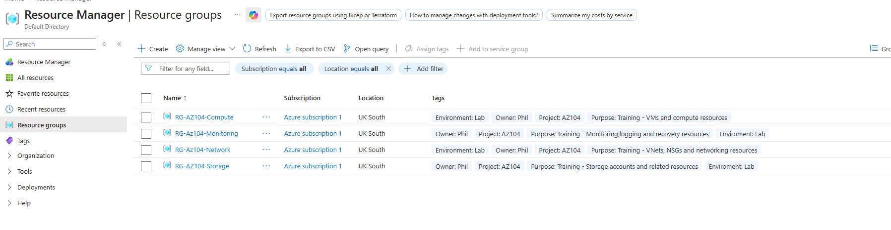
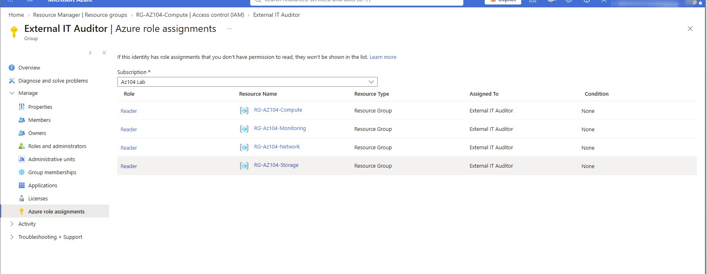
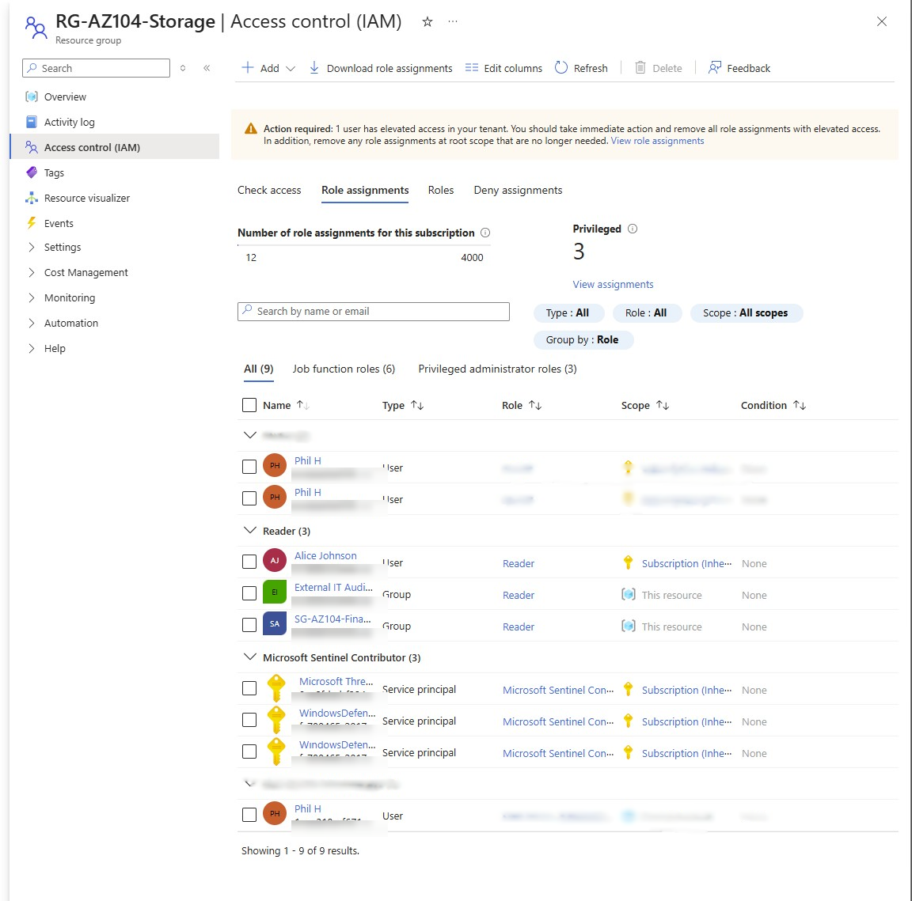
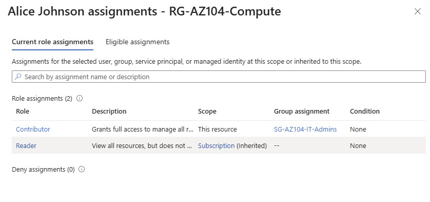
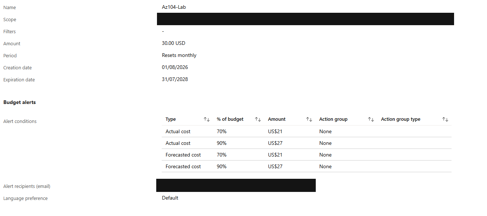
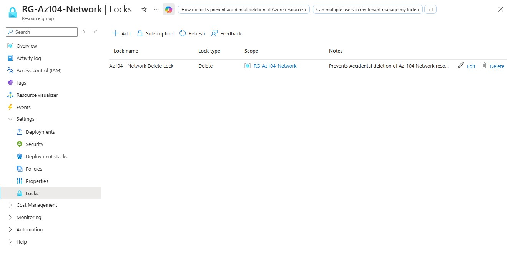
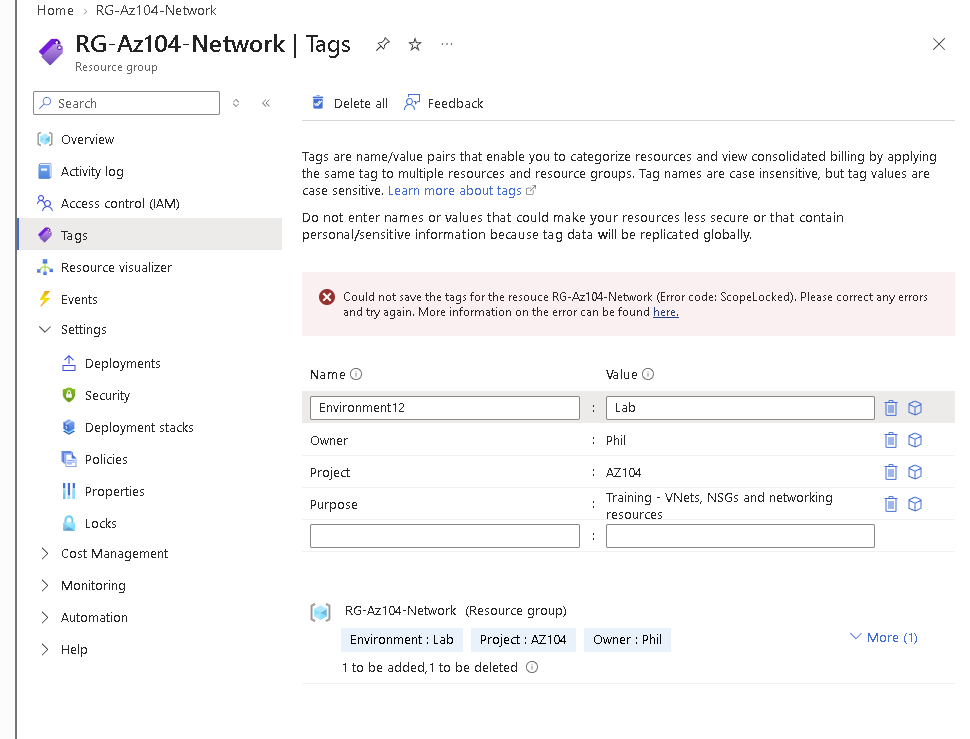
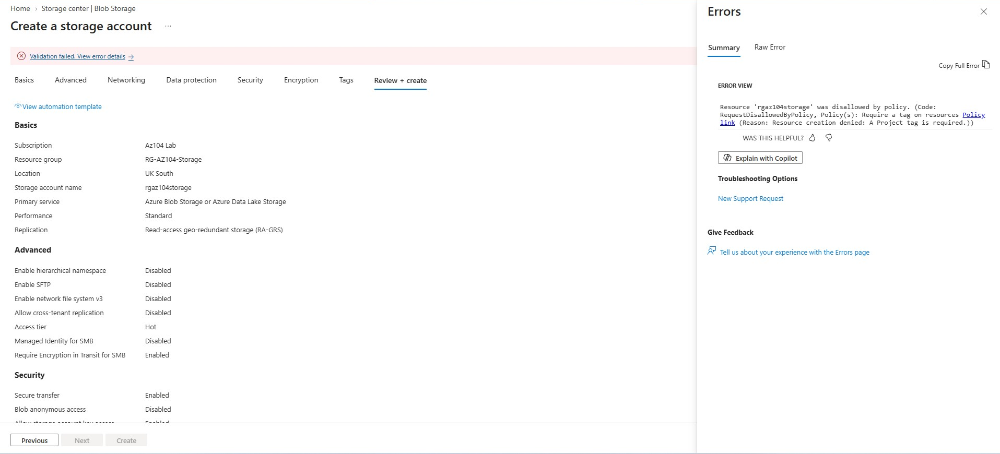
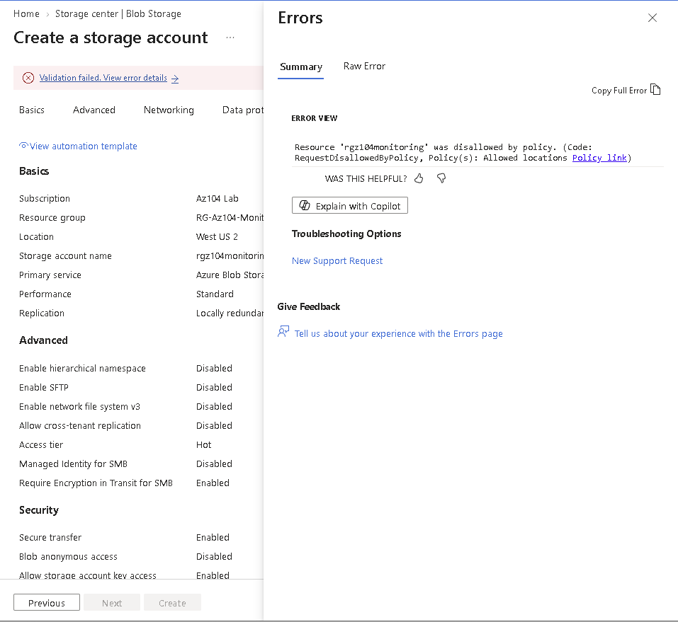
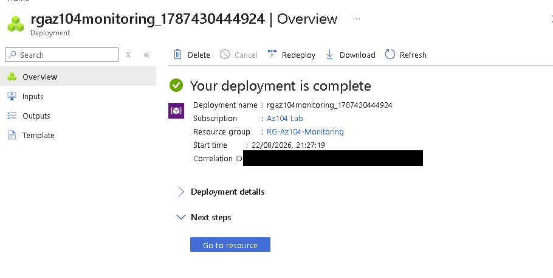

# Governance and access control

[Project overview](../README.md)

## Purpose and context

I used this part of the lab to practise organising resources, applying scoped access and testing whether governance controls actually changed the outcome of an attempted operation. These were personal lab scenarios rather than organisation-wide controls.

## Resource organisation and tags

I separated the main workloads into Compute, Network, Storage and Monitoring resource groups in UK South. I applied tags such as `Environment`, `Owner`, `Project` and `Purpose` so that the resources could be grouped and understood beyond their names.

*Evidence 01: the resource-group view records the main groups and their lab tags.*

The screenshot establishes the recorded structure and tags. It is not a current subscription inventory.

## RBAC and effective permissions

I assigned Contributor access to the IT administration group at the Compute resource-group scope and used read-only assignments for Finance and external-auditor scenarios. I then checked a lab user's effective assignments rather than relying only on the role-assignment workflow.

*Evidence 07: `SG-AZ104-IT-Admins` has Contributor at the Compute resource-group scope.*

*Evidence 08: `SG-AZ104-Finance` has Reader at the Storage resource-group scope.*

I also reviewed the external-auditor group across the four lab resource groups and checked how the Storage scope combined direct group assignments with inherited access.

*Evidence 09: the auditor group has Reader rather than administrative access across the recorded scopes.*

*Evidence 10: direct group assignments and an inherited subscription-level Reader assignment are shown separately.*

*Evidence 11: the selected user had group-derived Contributor access at this resource and inherited Reader access.*

This supported the lesson that role, principal and scope all matter. The screenshots are selected evidence for the named lab scenarios; they are not a full tenant access audit.

## Budget configuration

I configured a monthly US$30 lab budget with actual and forecast thresholds at 70% and 90%. My aim was to make cost awareness part of the lab rather than treat it as an afterthought.

*Evidence 03: the configured budget and thresholds are visible; the scope and recipient fields are redacted.*

This is budget configuration, not a spending cap. I did not capture a notification-delivery test and do not claim that the budget automatically stopped resources.

## Resource locks

I added a Delete lock to the Network resource group to protect it against accidental deletion.

*Evidence 04: the lock type is Delete at resource-group scope.*

In a separate test, I applied a ReadOnly restriction and attempted to change a tag. Azure returned `ScopeLocked`, so the failed change was the expected result of the control.

*Evidence 13: the attempted tag edit failed because of the lock.*

The Delete-lock configuration and the blocked ReadOnly test are different pieces of evidence. I have not merged them into one claim.

## Azure Policy negative tests

I used a policy that required a `Project` tag and submitted a storage-account deployment without that tag. Azure denied the request and identified the policy reason.

*Evidence 12: the deployment was rejected by the required-tag policy.*

I also tested an allowed-locations policy by selecting West US 2. The deployment was denied and the returned detail identified the location policy.

*Evidence 14: a second deliberate negative test produced the expected policy denial.*

These failures are successful tests of enforcement, not production incidents. During the exemption exercise, a later Monitoring deployment completed successfully.

*Evidence 15: the deployment completed; its correlation identifier is opaquely redacted.*

The completion screen does not display the exemption assignment itself, so I use it as evidence of the successful deployment only rather than independent proof of the exemption configuration or its exact scope.

## What I learned and limitations

I learned to separate permission, protection and compliance. Having permission to administer a resource does not bypass a lock or policy, and a blocked operation can be the correct result. I also learned to read the returned control-specific error before changing access.

The evidence covers selected lab assignments and negative tests. It does not establish a complete access review, a compliant tenant baseline, successful alert delivery or automatic cost enforcement.
