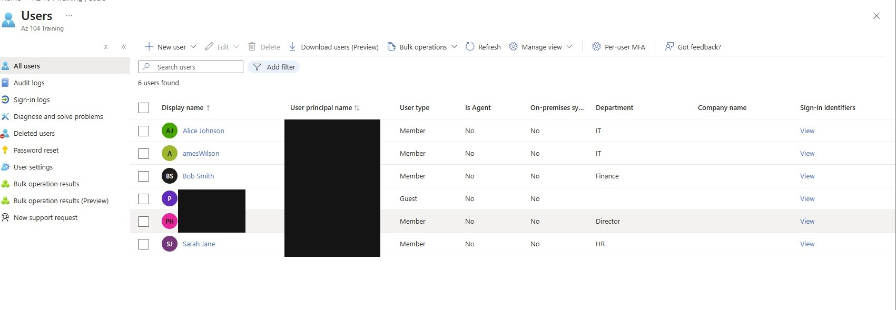

# Identity

[Project overview](../README.md)

## Purpose and context

I created test identities so that I could practise separating directory identity from authorisation to Azure resources. The directory contained synthetic users representing IT, Finance, HR and an external-auditor scenario, with both member and guest user types.

## What I configured and why

I created security groups for the lab responsibilities and used groups as the permission principals rather than assigning every Azure role directly to an individual. This made the access model easier to review and reflected the principle that identity lifecycle and resource authorisation are related but separate tasks.

The detailed Azure role and scope tests are in [Governance](../Governance/readme.md). The VM's system-assigned workload identity is covered in [Compute](../Compute/readme.md).

## How I checked it

I reviewed the Microsoft Entra user list to confirm that the lab identities, departments and user types had been created. The publication copy below opaquely removes personal account details and sign-in identifiers.

*Evidence 02: the lab directory contained the synthetic users used in the later group and access-control exercises.*

I then inspected effective access for a test user at resource-group scope. That separate test showed a Contributor assignment received through the IT group and an inherited Reader assignment, demonstrating that the user's effective access could not be inferred from one role label alone.

## What I learned and limitations

I learned that users, security groups and managed identities can all receive roles but serve different purposes. Group-based and inherited assignments both need to be considered when reviewing effective permissions.

This was a test directory, not an employee access review. I did not implement or evidence a production joiner/mover/leaver process, Conditional Access, Privileged Identity Management or formal access certification. Identity topics covered only in study questions are not presented as deployed controls.
