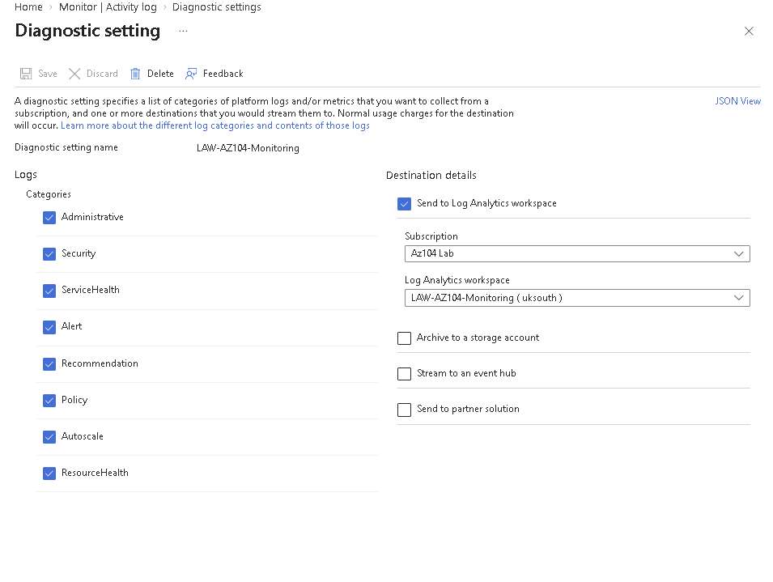
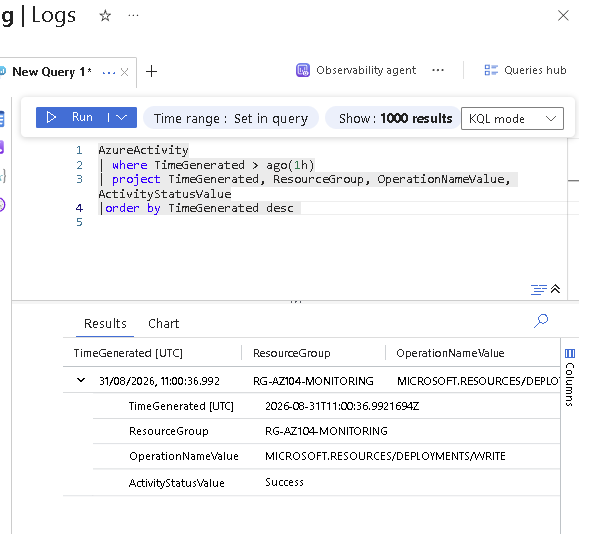
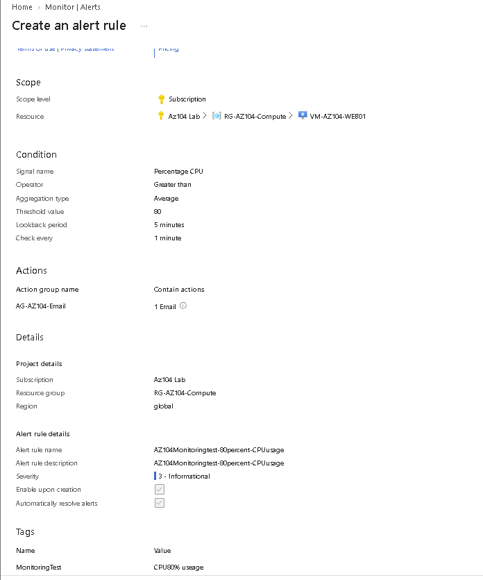
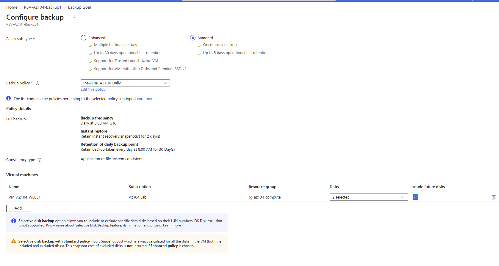
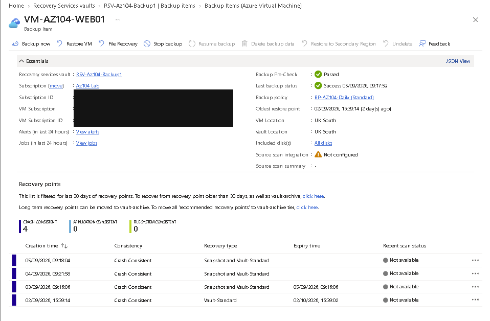
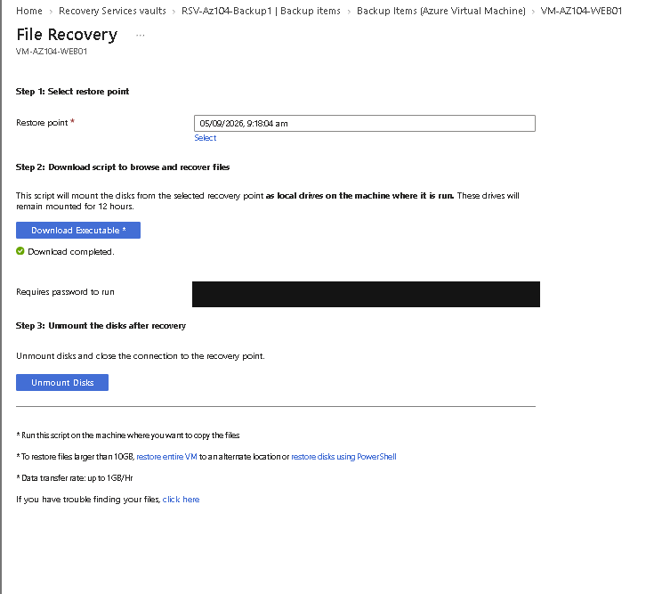

# Monitoring, alerts and backup

[Project overview](../README.md)

## Activity Logs into Log Analytics

I created `LAW-AZ104-Monitoring` in the Monitoring resource group. At first, there was no queryable `AzureActivity` data. I configured the subscription Activity Log to send Administrative, Security, ServiceHealth, Alert, Recommendation, Policy, Autoscale and ResourceHealth categories to the workspace.

*Evidence 53: the selected categories and workspace destination are visible.*

The captured diagnostic-setting name is `LAW-AZ104-Monitoring`. `DS-AZ104-ActivityLog` was discussed as a clearer name, but a completed rename is not evidenced, so I have not silently changed the history.

I then ran a focused KQL query:

~~~kusto
AzureActivity
| where TimeGenerated > ago(1h)
| project TimeGenerated, ResourceGroup, OperationNameValue, ActivityStatusValue
| order by TimeGenerated desc
~~~

*Evidence 54: the query returned a `MICROSOFT.RESOURCES/DEPLOYMENTS/WRITE` event with Success status.*

The [historical query file](Queries/azure-activity.kql) also retains the failure-filter exercise. A query returning no matching rows would not prove that no failures occurred outside the ingested data or selected time range.

**What I learned:** A Log Analytics workspace does not automatically contain subscription activity. I needed both the export configuration and evidence that data arrived.

## CPU alert and Action Group

I configured a metric alert for WEB01 with average Percentage CPU greater than 80%, a five-minute lookback and evaluation every minute. I selected `AG-AZ104-Email` with one email action.

*Evidence 55: the alert review screen records the condition and action selection.*

This is configuration evidence only. I did not capture the alert firing, an Action Group test or delivery of an email. The review screen places the alert resource in the Compute resource group; moving it to Monitoring was a suggestion, not a verified change.

## Backup policy and recovery points

I configured `BP-AZ104-Daily` in Recovery Services vault `RSV-AZ104-Backup1`. The recorded settings used a daily 08:00 UTC schedule, two days of Instant Restore snapshot retention and 30 days of daily vault recovery-point retention. The workflow included the OS and data disks and selected future disks.

*Evidence 56: the Standard policy records the daily schedule, two-day Instant Restore retention, 30-day recovery-point retention and selected VM disks.*

I initiated a backup and later observed four successful crash-consistent recovery points. The older point was in Vault-Standard only, while newer points also showed Snapshot storage.

*Evidence 57: the backup item and storage tiers are visible; subscription identifiers are redacted.*

This demonstrates available recovery points, not a successful restoration. LRS was a low-cost lab choice rather than a recommendation for every recovery requirement.

## Recovery workflows inspected

I inspected the Create new VM, Replace existing disks and File Recovery options. In the File Recovery workflow, I downloaded the executable, reviewed the mount process and reported using Unmount Disks.

*Evidence 58: the workflow was opened and a recovery point selected; the credential is opaquely removed.*

I did not validate a restored VM or copy a recovered test file back into place. The executable and password are not included.

## What I learned and limitations

I learned to distinguish collection configuration from ingested data, an alert definition from a delivered notification, and a backup from a proven restore. Recovery evidence is strongest when the restored service or file is validated; that final step was not carried out here.

The Stop Backup workflow was configured with deletion of lab backup data, but the repository contains no final post-deletion inventory or billing export. I therefore do not claim that all retained data or charges ceased.
