# Networking and private connectivity

[Project overview](../README.md) · [Lab layout](../Architecture/readme.md)

## Purpose and network layout

I built the network exercises to separate address design, traffic filtering, route selection and name resolution. `VNET-AZ104-PROD` used `10.0.0.0/16` with WEB (`10.0.1.0/24`), APP (`10.0.0.0/24`) and private-endpoint (`10.0.2.0/24`) subnets. A separate management VNet used `10.1.0.0/16`.

The first captured subnet view shows the WEB subnet before the later APP and private-endpoint work.

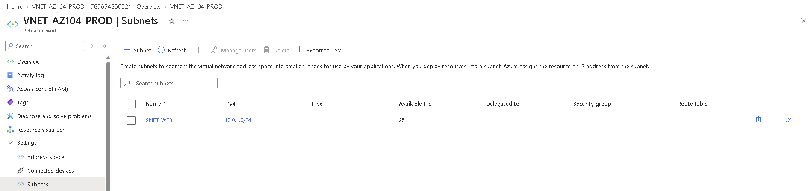

*Evidence 25: the WEB subnet range is visible in the VNet.*

A later view captured both the WEB and APP subnets:

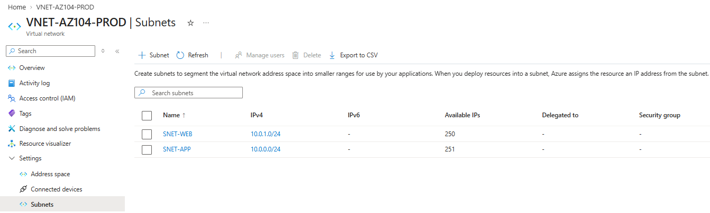

*Evidence 32: `SNET-WEB` uses `10.0.1.0/24` and `SNET-APP` uses `10.0.0.0/24`.*

The private-endpoint subnet was added later and is supported by the endpoint evidence below. I have not used either subnet-list image to imply that every later subnet was already present at the time it was captured.

## Network security groups

I restricted RDP to WEB01 through a NIC NSG, using priority 1010 and a single `/32` source. The personal public source address is removed from the publication copy.

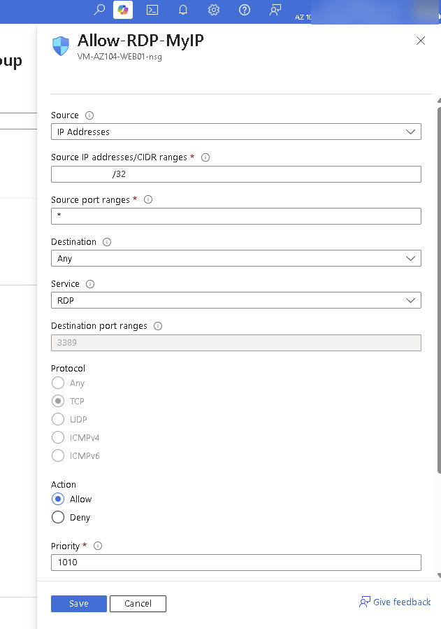

*Evidence 26: the rule editor records TCP 3389, Allow and priority 1010 without publishing the source address.*

I then checked the NIC's effective security rules rather than relying only on the configuration form.

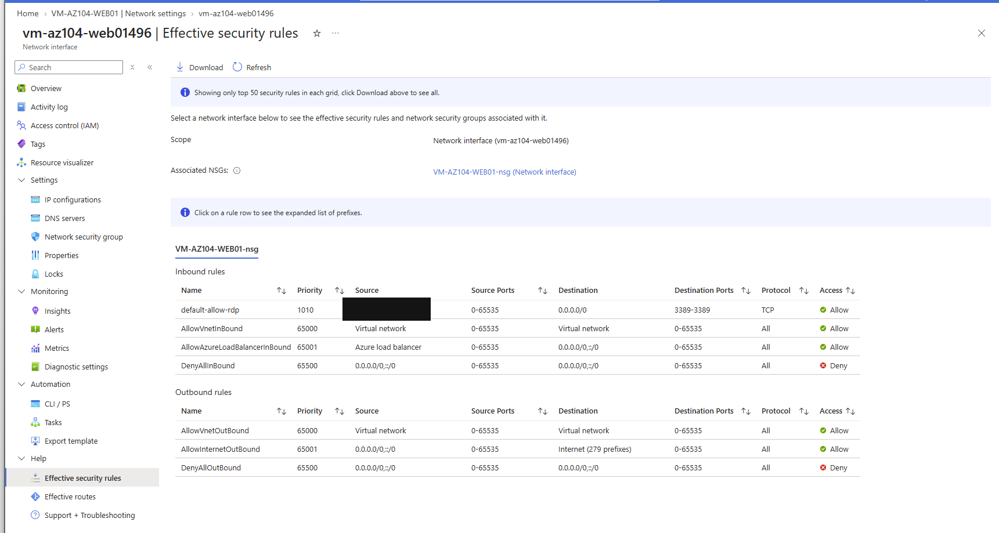

*Evidence 37: priority 1010 permits TCP 3389 from the redacted source, followed by Azure's default rules.*

For the APP subnet, I added an inbound TCP 8080 rule from the WEB subnet range `10.0.1.0/24` at priority 300.

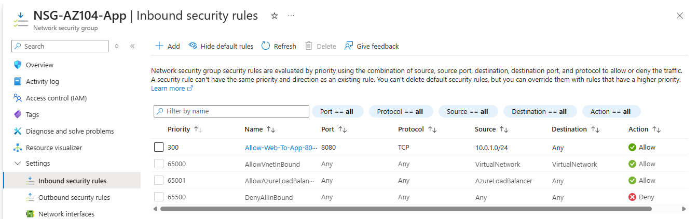

*Evidence 33: the custom rule exists, but `AllowVnetInBound` also remains.*

The custom rule did not, by itself, establish exclusive TCP 8080 isolation because the default `AllowVnetInBound` rule continued to allow virtual-network traffic. There was also no APP VM on which to test the application port. This is configuration evidence, not an end-to-end isolation test. The behaviour matches Microsoft's [NSG default-rule documentation](https://learn.microsoft.com/en-us/azure/virtual-network/network-security-groups-overview).

I ran Network Watcher Connection troubleshoot from WEB01 to `10.0.0.4` on TCP 8080. The result was unreachable even though the outbound NSG diagnostic allowed the flow and route selection succeeded.

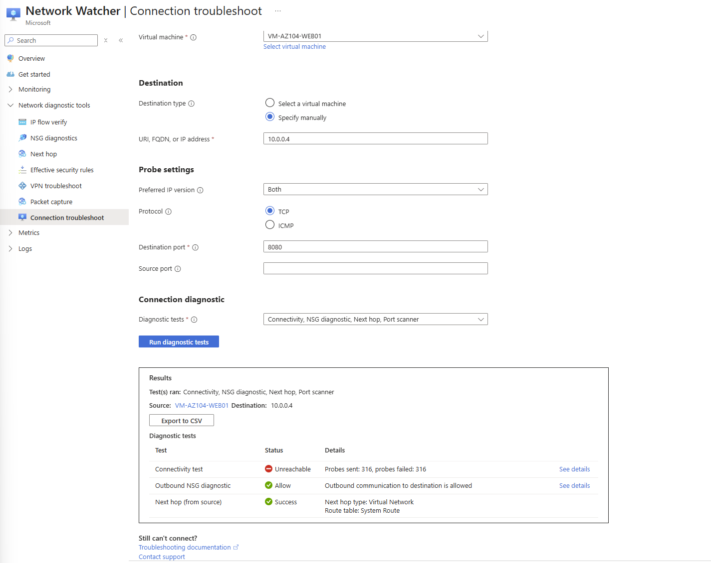

*Evidence 38: the probes failed, while the outbound NSG diagnostic reported Allow and the next hop reported Virtual Network.*

This separates control configuration from application availability: the screenshot does not show an NSG denial, and there was no listening APP workload at the destination.

## Deliberately broken route and recovery

I first associated `RT-AZ104-APP` with `SNET-APP` and recorded a custom default route to the Internet.

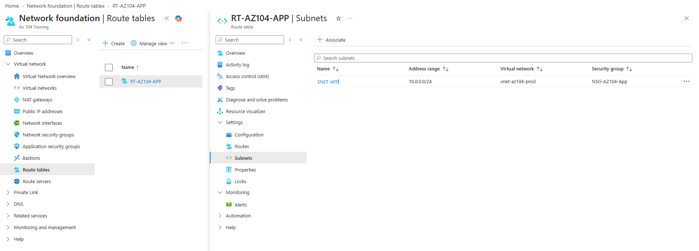

*Evidence 34: the route table is associated with the APP subnet at `10.0.0.0/24`.*

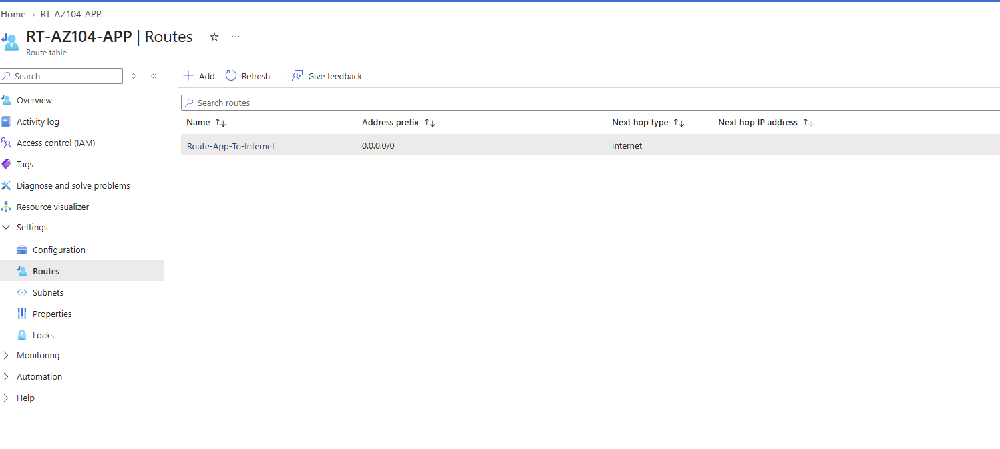

*Evidence 35: `Route-App-To-Internet` uses prefix `0.0.0.0/0` and next-hop type Internet.*

Before attaching a route table to WEB, the NIC's effective-route view showed no associated route table and the expected active system routes.

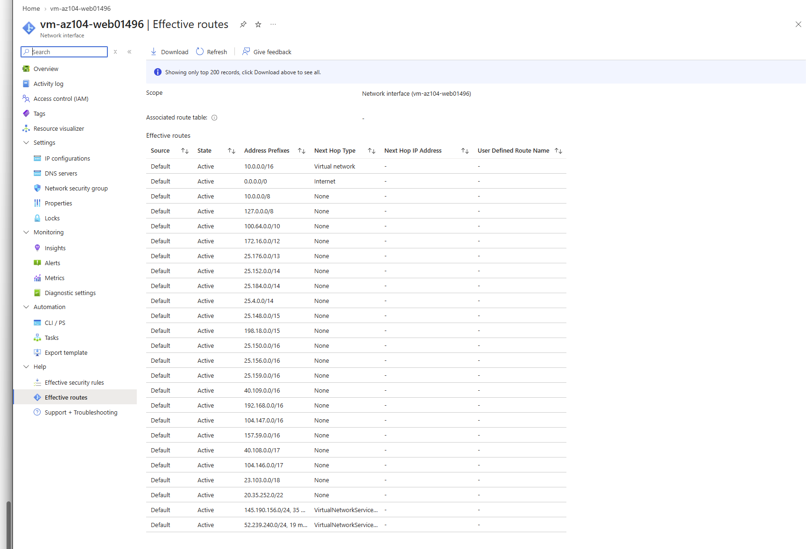

*Evidence 36: the NIC had no associated route table and used the active Virtual network and Internet system routes.*

Network Watcher also returned `VirtualNetwork` and `System Route` for the path from `10.0.1.4` to `10.0.0.4`.

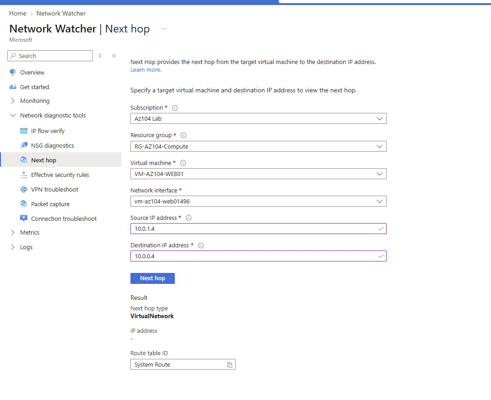

*Evidence 39: the baseline route decision used the system virtual-network route; it does not prove that a service was listening at the destination.*

I then associated `RT-AZ104-WEB` with `SNET-WEB` and deliberately added a `10.0.0.0/24` route using configured next-hop address `10.0.2.4`, representing an NVA that did not exist at that point in the lab.

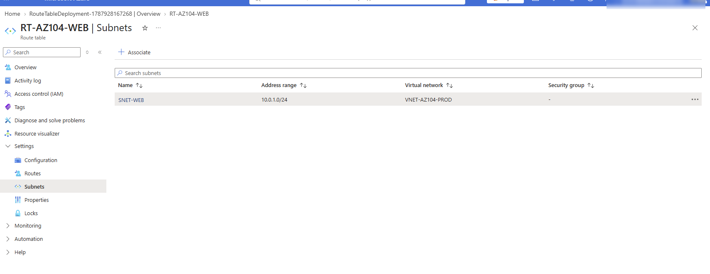

*Evidence 41: the WEB route table is shown against `SNET-WEB`.*

Network Watcher returned `None` for the resulting path and displayed the configured next-hop address.

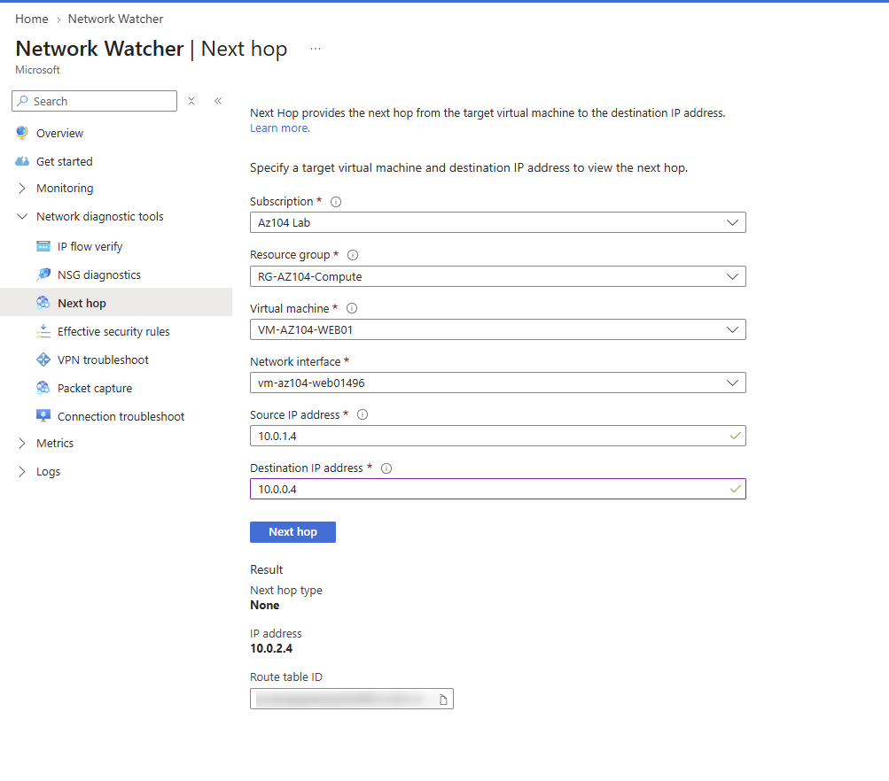

*Evidence 42: the route decision returned None with next-hop address `10.0.2.4`; the full route-table identifier is redacted.*

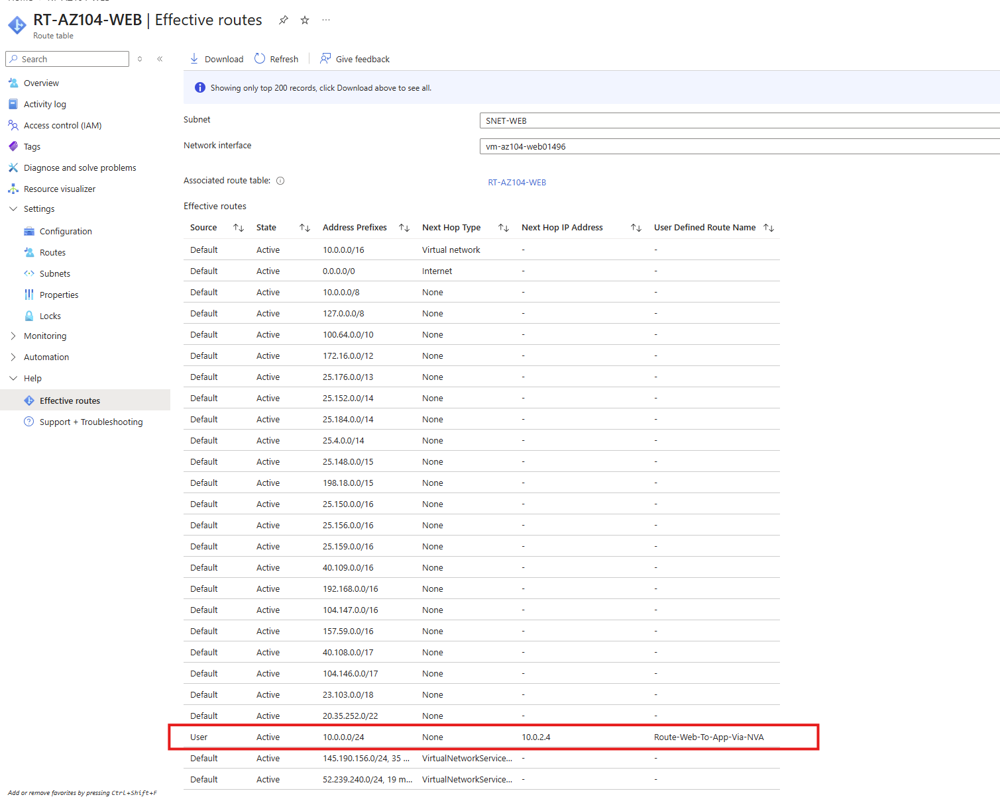

*Evidence 43: the active user route was recorded as `10.0.0.0/24 / None / 10.0.2.4`.*

I had expected a `VirtualAppliance` result, but the captured result showed `None`. I preserve what Azure displayed rather than rewriting the history to match the prediction.

I removed the bad route and ran Network Watcher Next Hop for source `10.0.1.4` and destination `10.0.0.4`.

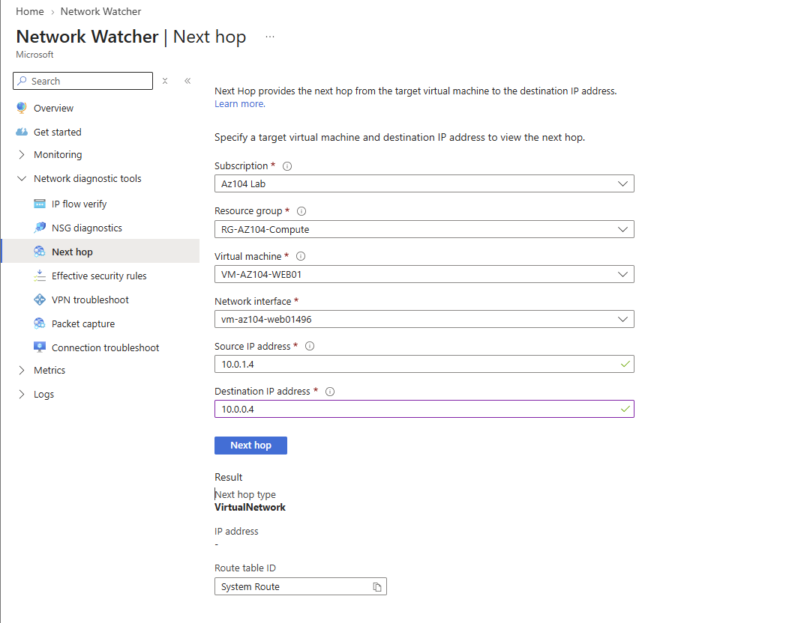

*Evidence 44: Azure's normal system route was selected again.*

This verifies route recovery, not application recovery. There was no workload at `10.0.0.4`, so I could not test a destination service.

## Peering and private DNS

The management VNet used address space `10.1.0.0/16`. Its captured subnet was the Azure-created `default` subnet at `10.1.0.0/24`, rather than the earlier requested name `SNET-MGMT`.

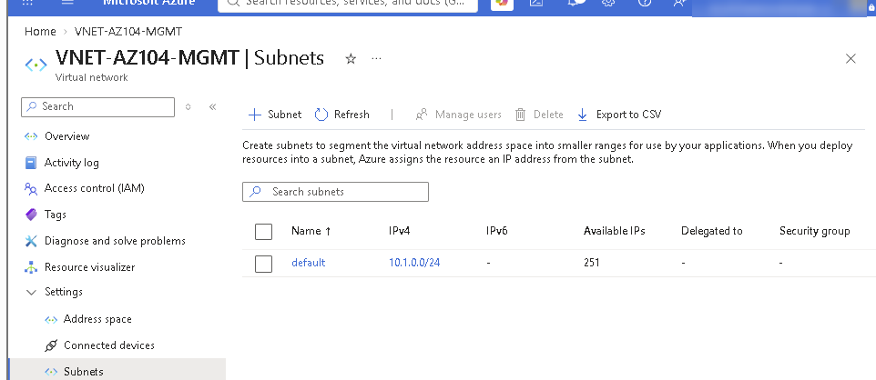

*Evidence 45: the captured management subnet is named `default`; the walkthrough retains that observed name rather than inventing a rename.*

I peered the PROD and MGMT VNets. The captured PROD-to-MGMT peering showed `Connected` and `Fully Synchronized`.

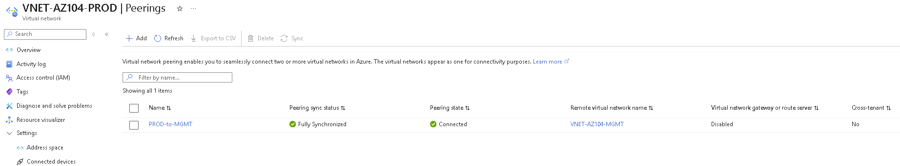

*Evidence 46: the peering control-plane state was healthy.*

The WEB NIC's effective-route view subsequently included `10.1.0.0/16` with next-hop type `VNet peering`.

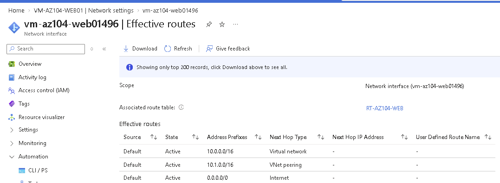

*Evidence 47: the peering route was active on the PROD NIC.*

I did not capture a workload-to-workload connection from PROD to a running VM in MGMT, so the evidence establishes control-plane state and route propagation rather than tested application connectivity.

I created the private DNS zone `az104.internal` and linked it without auto-registration. At capture time, the PROD link was completed while the MGMT link was still in progress.

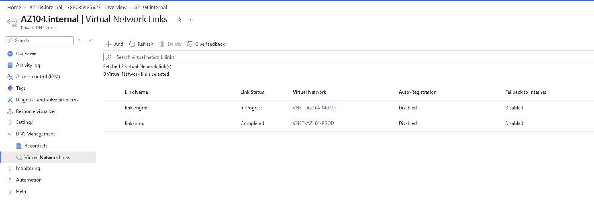

*Evidence 48: `link-prod` is Completed and `link-mgmt` is InProgress; both have auto-registration disabled.*

I added `web01` as an A record for `10.0.1.4`; the later command-line result also records `portal` resolving through a CNAME.

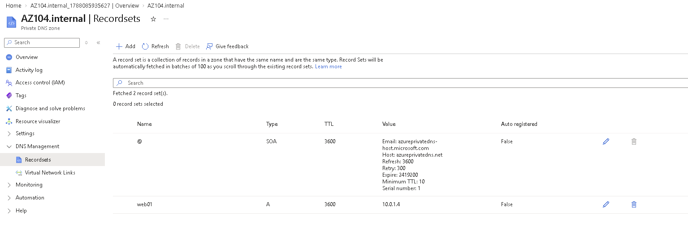

*Evidence 49: the zone contains the `web01` A record with TTL 3600 and value `10.0.1.4`.*

I queried both names from WEB01.

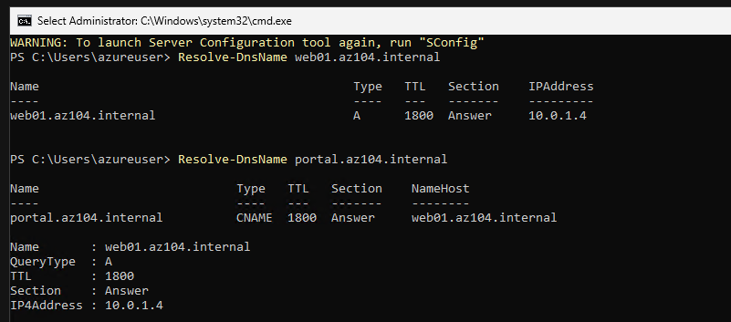

*Evidence 50: both names resolved from the PROD VM.*

This confirms the recorded resolution from PROD. A corresponding query from MGMT was not captured.

## Blob private endpoint

I created a Blob private endpoint in `SNET-PRIVATE-ENDPOINTS` and integrated the `privatelink.blob.core.windows.net` zone. The endpoint NIC received `10.0.2.4`.

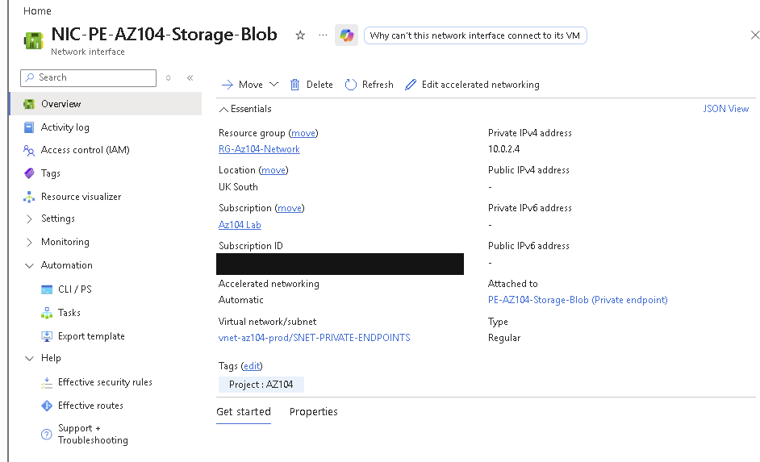

*Evidence 51: the endpoint NIC, subnet and private address are visible; the subscription identifier is redacted.*

The reuse of `10.0.2.4` did not turn the endpoint into the earlier dummy NVA. The deliberately bad UDR had already been removed.

From WEB01, I resolved the normal storage hostname. DNS returned a CNAME to the private-link name and the private address `10.0.2.4`.

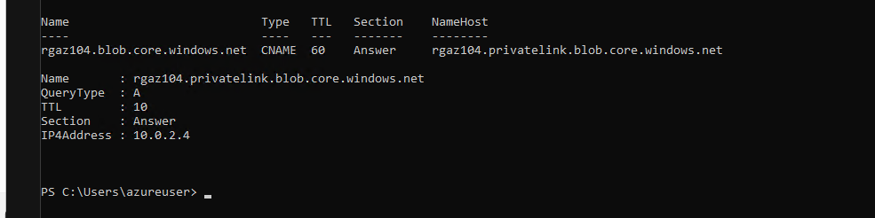

*Evidence 52: private DNS resolution succeeded from the VM.*

This is not evidence of a Blob transfer through Private Link, and I did not capture a test proving public network access was disabled. Microsoft's [Storage private endpoint guidance](https://learn.microsoft.com/en-us/azure/storage/common/storage-private-endpoints) confirms that creating a private endpoint does not automatically block the public endpoint.

## What I learned and limitations

I learned to treat NSGs, routing and DNS as separate layers: an NSG answers whether a flow is permitted, routing selects a next hop and DNS supplies an address. Success at one layer is not proof that the whole application works.

NAT Gateway, gateway transit and load-balancing scenarios were reviewed but not deployed as additional lab resources.
