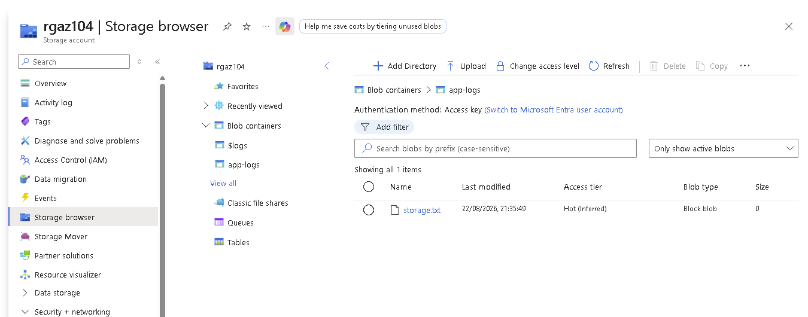
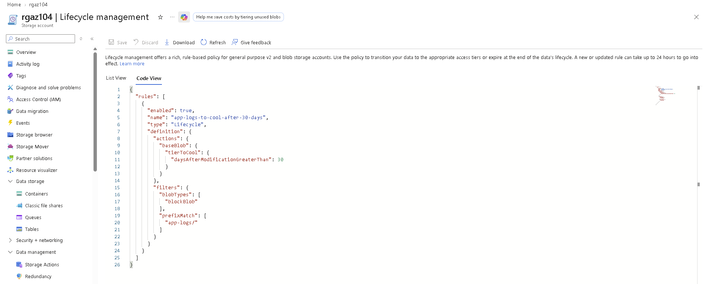
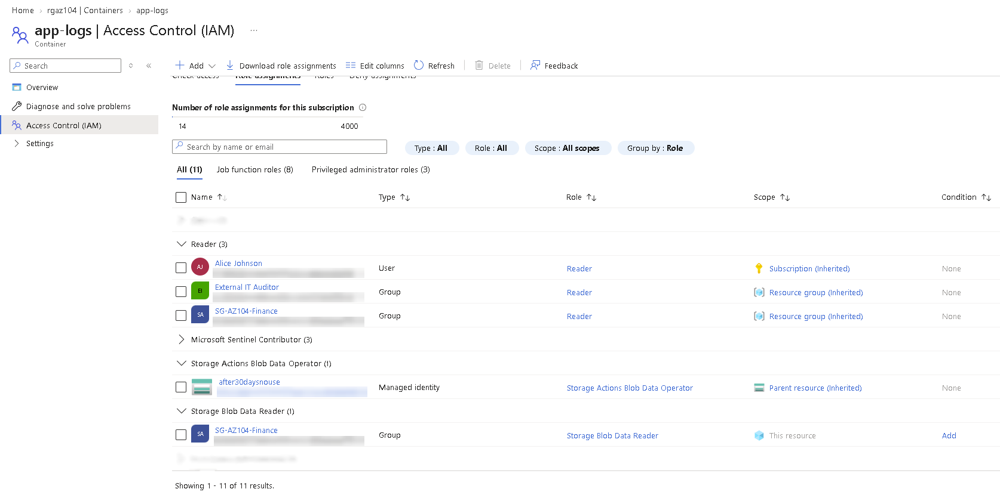
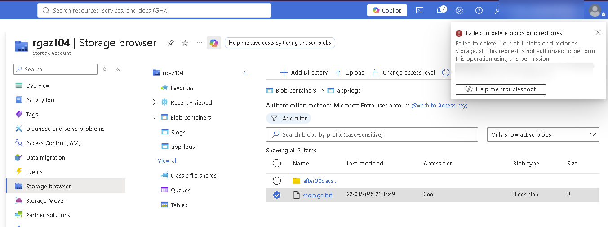
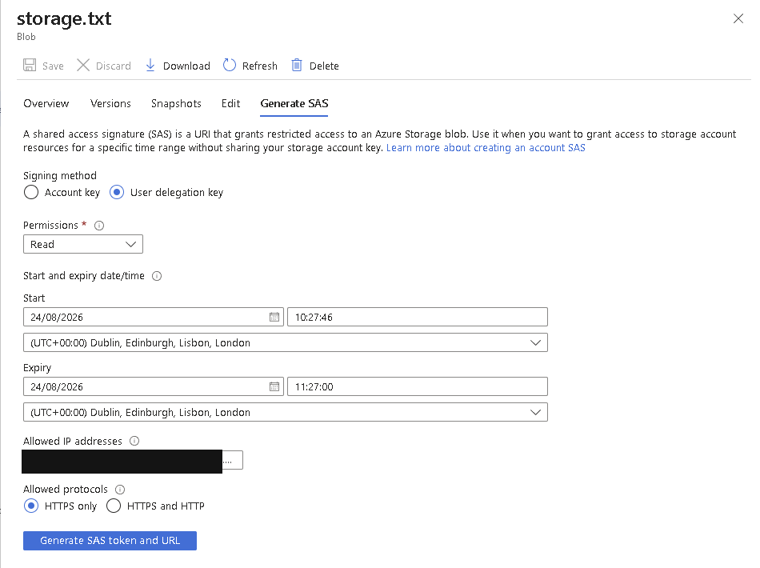
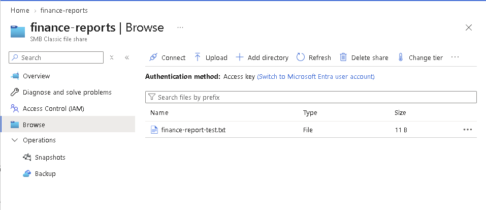
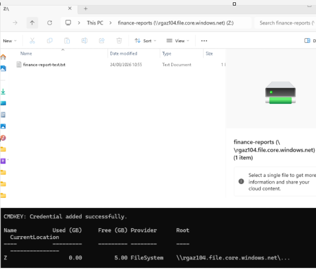
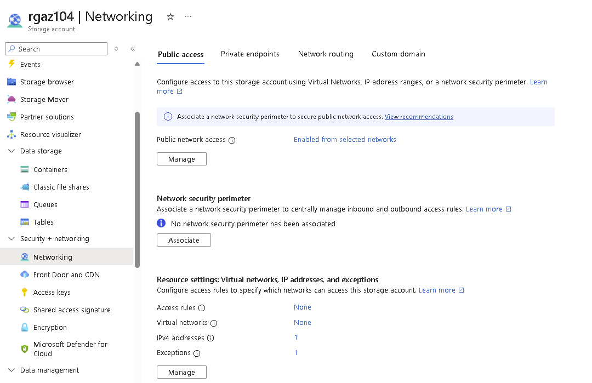
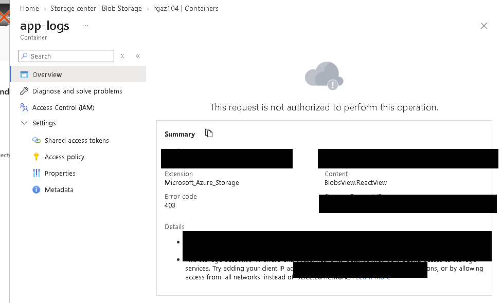

# Storage

[Project overview](../README.md)

## Purpose and context

I used the storage exercises to compare data access, lifecycle management, shared access, file-share mounting and network restrictions. The lab storage account was `rgaz104`; the recorded data included the `app-logs` Blob container, `storage.txt` and the `finance-reports` Azure Files share.

## Blob container and lifecycle rule

I created the `app-logs` container and used `storage.txt` as a small test object. The existing container screenshot confirms the object was present, but its browser view does not independently prove the anonymous-access setting.

*Evidence 16: the test container and Blob existed; the image is not used as proof that anonymous access was disabled.*

I then configured a lifecycle rule named `app-logs-to-cool-after-30-days`. It targeted block blobs under the `app-logs/` prefix and used `daysAfterModificationGreaterThan: 30` to move matching data to Cool storage.

*Evidence 17: the rule uses last modification time and a prefix filter.*

I did not wait 30 days to observe automatic execution. This is evidence of configuration, not proof of a completed age-based transition.

## Data-plane RBAC negative test

I assigned `SG-AZ104-Finance` the Storage Blob Data Reader role at the `app-logs` container. This separated Blob data access from broader management access to the storage account.

*Evidence 18: the container scope shows the Finance group with the Blob data-reader role alongside inherited Reader assignments.*

Using Microsoft Entra user authentication in Storage browser, I selected `storage.txt` and attempted a delete operation. Azure rejected the request because the signed-in identity did not have permission to delete the Blob.

*Evidence 19: the portal reports that deletion was not authorised; request-specific details are redacted.*

This negative test demonstrates that read access did not silently provide write or delete permission. The screenshots record the role and denied operation, but they are not a complete review of every effective assignment on the identity.

## User-delegation SAS configuration

I configured a user-delegation SAS for read permission, HTTPS only and a short validity period. I did this to practise narrowing delegated access without publishing an account key.

*Evidence 20: the selected settings are visible and the client IP field is opaquely redacted.*

No generated SAS token or signed URL is included. I did not capture a subsequent use or expiry test, so I describe this as configured rather than functionally verified.

## Azure Files over SMB

I created the `finance-reports` share and added a small test file.

*Evidence 21: the Azure Files share and test file are visible in the portal.*

I then mounted the share as drive `Z:` from Windows and confirmed that the test file was visible.

*Evidence 22: the mount command completed and Windows displayed the share contents.*

This recorded workflow used the account-key/credential-store approach. It is not evidence of Microsoft Entra Kerberos or identity-based SMB authentication.

## Network restriction and workload access

I changed public endpoint access to selected networks and recorded the resulting storage networking page.

*Evidence 23: selected-network access was configured; this is not the same as disabling the public endpoint.*

I then opened the Blob container from a client that was not authorised by the storage network rules. The portal returned HTTP 403 and identified the client-network restriction in the diagnostic text.

*Evidence 24: the request was blocked; the client address and request-specific diagnostic values are opaquely redacted.*

In a separate compute exercise, I assigned the VM's managed identity the Storage Blob Data Reader role and completed an authenticated read. The role and result are shown in [Compute](../Compute/readme.md). Later, I created a Blob private endpoint and verified DNS resolution; that separate work is in [Networking](../Networking/readme.md).

## What I learned and limitations

I learned that storage access has distinct identity, data-permission, network and DNS layers. A lifecycle rule is a data-management control rather than an authorisation control, and configuring a feature is not the same as observing it operate.

I did not perform regional failover, object replication, immutability or Azure Files identity-based authentication tests.
